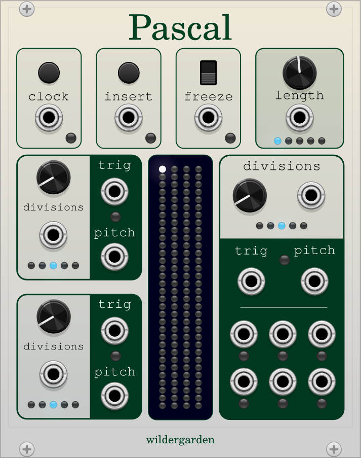

# Wildergarden plugin for VCV Rack

## Pascal

This plugin uses Pascal's triangle, a mathematical pattern independently invented throughout the world during the Middle
Ages, to create evolving melodies and drum sequences.

The light grid down the middle of the interface shows the current rows of the triangle as they are computed. (The rows
are turned vertically to save space.) As a row is computed, the $n$th spot is set to the sum of the $n$th and $n-1$th
items in the previous row. Rather than grow forever, these numbers are looped around, modulo the moduli of the output
units.

### Main Inputs

The computation and output of a row steps every time the **clock** input goes low. If an input is received to the 
**insert**, the currently selected number is set to 1.

Once the counter reaches the end of a row, it advances to the next row, using the row that was just computed to compute
the next row, unless there is **freeze** input, in which case it will stay on the current row.

The maximum row length is set by the **length** input. Anything past that length is set to zero, so setting a short
length can be a good way to clear the grid.

### Output Sectors

Pascal has three output sectors, which send out triggers and pitch for the current spot on the row. The **divisions**
input sets the modulus for that particular output sector. Every time the current row item is nonzero modulo that number,
the **trigger** will output and the pitch will be set to the row item mod that modulus. The pitch values range between
0 and 5V, and are not quantized to a scale.

The third output sector has six additional trigger outputs that trigger on the first six nonzero modulo values. This is
useful for programming a pattern across multiple drums.

## Dimit

Dimit is a combined compressor and waveshaper, designed to tame peaks in an audio signal. The **threshold** input sets a
voltage above which peaks are tamed. The **grit** input sets how quickly it resolves the signal above that voltage: 
higher grit means quicker response, and more harmonic distortion. **In** and **out** are for the audio signal to be
compressed or distorted.